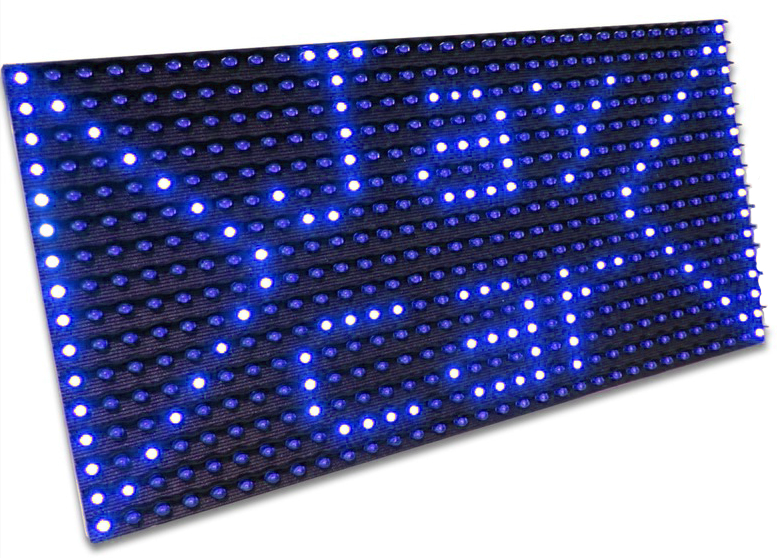

<p align="center">
    
</p>

The present setup and librrary can control an array of up to 8 panels at 100 Hz. C++ and Python can be used to drive the display.

# Layout

## Connections

Multiple panels can be connected to build a large display. The panels must be sequentially connected from left to right and bottom to top in an S shape, seen from the __back__.

For example, a 4 x 3 panels display seen from the __back__ must be connected as follows:
```md
          ∟ → ∟ → ∟ → ∟
          └───────────┐
          ∟ → ∟ → ∟ → ∟
          └───────────┐
arduino → ∟ → ∟ → ∟ → ∟
```

## Code parameters

The following files must be edited to configure the number of panels and their layout:
- __arduino/arduino.c__: set `frame_size` to `width * height * 64`, where `width` is the number of horizontal panels and `height` the number of vertical panels. For example, for two horizontal panels:
  ```c
  #define frame_size 128
  ```
  For large displays, you may have to reduce the size of the cyclic frame buffer. Make sure to change the size `read_buffer_index.read` and `read_buffer_index.write` accordingly.

- __pi/scripts/led_panel.py__: set `panels_width` (respectively `panels_height`) to the number of vertical (respectively horizontal) panels. For example, for two horizontal panels:
    ```py
    panels_width = 2
    panels_height = 1
    ```

# Dependencies

## Arduino

The Arduino Nano code does not use the Arduino IDE or the Arduino standard library: it targets the ATmega328P microcontroller directly. You will need the following libraries to compile the code and flash the Arduino Nano chip:

- __Debian / Ubuntu__:
  ```sh
  sudo apt install gcc-avr
  sudo apt install binutils-avr
  sudo apt install avr-libc
  sudo apt install avrdude
  ```

- __macOS__:
  ```sh
  brew tap osx-cross/avr
  brew install avr-libc
  brew install avrdude
  ```

## Raspberry Pi

```sh
sudo apt install python3-pip
sudo pip install numpy
```

# Build

## Arduino

1. Set the `device` variable in __arduino/Makefile__. Plug in the Arduino Nano and run `ls /dev/tty*` (`ls /dev/tty.*` on macOS) to find the device name on your machine.

2. Go to the __arduino__ directory and run `make`.

3. Flash the device with `make flash`.

## Raspberry Pi

1. Set the `host` and `path` variables in __pi/deploy.sh__.

2. Run `bash deploy.sh`.

3. Connect to the Raspberry Pi, go to __led_panel/pi/scripts__ and run `python3 example.py`.

# Documentation

The display can be controlled using C++ or Python.

- __C++__: __pi/source/led_panel.hpp__ can be placed in any directory on the Pi. This header-only library only requires a C++17 compiler and the associated standard library. It can be used as follows:
  ```cpp
  #include "led_panel.hpp"

  int main(int argc, char* argv[]) {
      led_panel display(2, 1); // number of horizontal and vertical panels
      for (;;) {
          // the first byte of the frame is the brightness
          // the other bytes encode the pixels in row major ordering (8 pixels per bytes)
          // the leftmost pixel of a byte is encoded by the most significant bit
          std::vector<uint8_t, 1 + 2 * 1 * 64> frame;

           // display.send blocks until the display has received the frame
          // the loop will run at 100 Hz
          display.send(frame);
      }
  }
  ```

- __Python__: copy __pi/scripts/led_panel.py__ next to your scrip and import `led_panel`, or use relative imports. See __pi/scripts/example.py__ for an example.

# Format

After editing __arduino/arduino.c__, run `clang-format -i arduino.c` from the __arduino__ directory.

After editing one of the files in __pi/source__, run `clang-format -i *source/*.hpp source/*.cpp` from the __pi__ directory.
